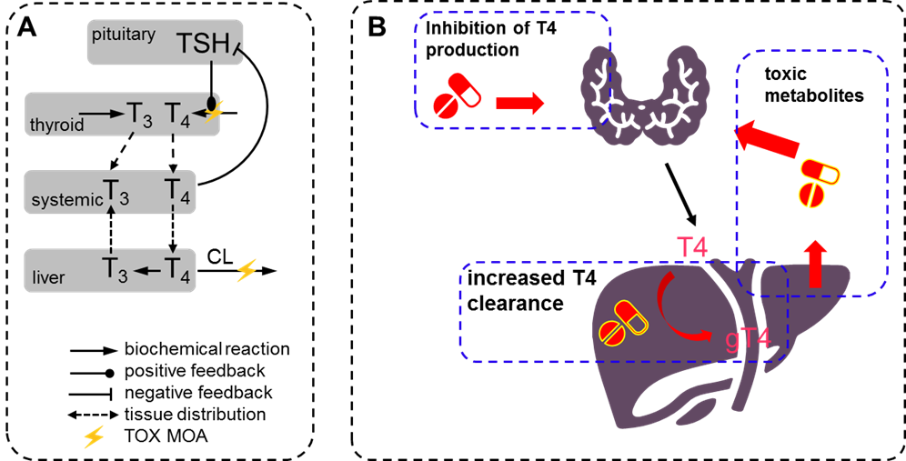

# Physiology-based systems pharmacology model of thyroid hormones regulation in rat and human.

Within this repository we distribute a physiology-based (PB) quantitative systems pharmacology/toxicology (QSP/T) model of thyroid hormones model for human and rat. The model has been first presented at the QSPC conference in 2022 [[1](#references)]. The model describes synthesis, distribution, clearance, and regulatory feedbacks of thyroid stimulating hormone (TSH), thyroxine (T4), and triiodothyronine (T3) as indicated in **Figure 1 A**. Note, the conversion of T4 to T3 depicted in **Figure 1 A** occurs in any target tissue and is catalyzed by iodothyronine deiodinase. The model shall furhtermore includes PB pharmacokinetics (PBPK) models of the three compounds propylthiouracil (PTU), methimazole (MMI), and phenobarbital as perpetrators of T4 synthesis and clearance (**Figure 1 B**).



The PBPK model structure has been created with PK-Sim version 8 and extended in MoBi. A thyroid organ as described in [[2](#references)] has been added to the organ structure. Additionally, a pituitary gland organ has been added.

Following processes have been implemented:

### T3:
- Synthesis in thyroid
- Production through enzymatic conversion of T4 by deiodinase (DIO)
- Liver plasma clearance
- Inhibits TSH production

### T4:
- Synthesis in thyroid
- Linear plasma clearance
- Enzymatic conversion to T3 by DIO
- Inhibits TSH production

### TSH:
- Synthesis in pituitary gland
- Synthesis controlled by circadian rhythm (in human only)
- Endosomal clearance for peptides
- Induces production of T3 and T4 in thyroid

### Methimazole (MMI)
- Inhibits synthesis of T3 and T4 in thyroid

### Propylthiouracil (PTU)
- Inhibits synthesis of T3 and T4 in thyroid
- Inhibits conversion of T4 to T3 by DIO

### Phenobarbital
- Increases intracellular binding of T4 in hepatocytes
- Induces hepatic clearance of T4

## Repository files

This repository contains following files:

- `Menshykau_ThyroidHormoneTox_QSPC_poster.pdf` - poster presentation of the QSP/T model [[1](#references)].
- `Thyroid PBPK.pksim5` - PK-Sim project file with PBPK models of implemented compounds. The project is only used for creation of the PBPK backbone that is extended in MoBi. Final parametrization for simulations is performed in supplied `R` scripts.
- `Thyroid QSP.mbp3`: MoBi project file with implemented model structure. Final parametrization for simulations is performed in supplied `R` scripts, the results produced with parametrization stored in MoBi might not be valid.
- `SimulationFramework` folder - R scripts and associated files required to reproduce the results. See [Running the scripts](#running-the-scripts) for details.
- `Packages` folder - R packages required to run the provided scripts. See [Running the scripts](#running-the-scripts) for details.

## Running the scripts

To run the provided scirpts, you will require **R verion 3.6 (R4.x is currently not supported!)** and the packages provided in the folder `Packages`.
- First, install dependencies from CRAN by executing
```
install.packages(c("R6", "stringr", "readr", "openxlsx"), dependencies = TRUE)
```
- Install [`rClr` version 0.9.1](https://github.com/Open-Systems-Pharmacology/rClr/releases/tag/v0.9.1-R3)
- Install [`ospsuite` version 9.1.4](https://github.com/Open-Systems-Pharmacology/OSPSuite-R/releases/tag/v9.1.4)
- Install `esqlabsR` version 1.1.0

The provided scripts do the following:
- Load the simulation that has been exported from MoBi to `pkml` file
- Applies the correct parametrization from the `SimulationFramework\Parameters\Thyroid_QSP_parameters.xlsx` file
- Set application protocols as defined in the file `SimulationFramework\Code\GeneralCode\Applications.R`
- Run the simulations
- Create figures comparing simulation results with observed data stored in the file `D:\SimulationFramework\Data\CompiledDataSet.xlsx` and stores the figure in `SimulationFramework\Results\`, if specified

To run the scirpts:
- Open RStudio project file `Thyroid_QSP.Rproj` located in the folder `SimulationFramework\Code\`
- In RStudio, open file `script.R`.
The script will perform initalization (loading of the required packages and creating a configuration object that holds information about paths to the required files) and run the different simulation scenarios. You can run the specific scenarios by manually executing the respective code lines.

## Version information
- The physiology is based on the PBPK model implemented in PK-Sim version 8.
- The provided packages run with R version 3.6.

## Code of conduct
Everyone interacting in the Open Systems Pharmacology community (codebases, issue trackers, chat rooms, mailing lists etc...) is expected to follow the Open Systems Pharmacology [code of conduct](https://github.com/Open-Systems-Pharmacology/Suite/blob/master/CODE_OF_CONDUCT.md#contributor-covenant-code-of-conduct).

## Contribution
We encourage contribution to the Open Systems Pharmacology community. Before getting started please read the [contribution guidelines](https://github.com/Open-Systems-Pharmacology/Suite/blob/master/CONTRIBUTING.md#ways-to-contribute). If you are contributing code, please be familiar with the [coding standard](https://github.com/Open-Systems-Pharmacology/Suite/blob/master/CODING_STANDARDS.md#visual-studio-settings).

## License
The model code is distributed under the [GPLv2 License](https://github.com/Open-Systems-Pharmacology/Suite/blob/develop/LICENSE).

## References
[1] [Menshykau D., et al. QST Model for the Hypothalamic-PituitaryThyroid Axis in Rat and Human. QSPC 2022, Leiden, The Netherlands
[2] [Pilari, S., Gaub, T., Block, M. & Görlitz, L. Development of Physiologically Based Organ Models to Evaluate the Pharmacokinetics of Drugs in the Testes and the Thyroid Gland: Development of Physiologically Based Organ Models. CPT Pharmacometrics Syst. Pharmacol. 6, 532–542 (2017).](https://pubmed.ncbi.nlm.nih.gov/28571120/)
